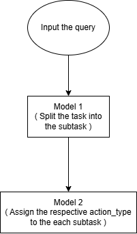

# 🤖 Agentic Assistant Demo

A minimal demo of an **Agentic AI system** built with [Streamlit](https://streamlit.io/), [LangChain](https://www.langchain.com/), and [Groq](https://groq.com/).  
It takes a high-level task, breaks it into subtasks, maps them into JSON actions, and simulates how agents execute them in real-time.

---

## 🧩 System Flow

---

## 🧠 Model Used
- **LLM**: `llama3-70b-8192` (via **Groq API**)  
- **LangChain**: prompt templates + JSON output parser  
- **Streamlit**: interactive frontend for user input & live logs  

---

## ⚡ Features
- Breaks a high-level task into **3–6 major subtasks**  
- Converts subtasks into **structured JSON actions** (`subtask`, `action_type`, `description`)  
- Simulates **agent execution logs** step by step  

---

## 🔎 Approach

1. **Task Decomposition**  
   - Used a **prompt with `llama3-70b-8192`** to break down the user query into **clear subtasks**.  
   - The model was instructed to return only a **numbered list** for clean parsing.  

2. **JSON Mapping**  
   - A second **structured prompt** was used with the same model.  
   - Subtasks were mapped into JSON objects with fields:  
     - `subtask` → original task  
     - `action_type` → one of predefined categories  
     - `description` → short explanation  

3. **Output Parsing**  
   - Used `JsonOutputParser` from LangChain to ensure valid JSON output.  

4. **Agent Simulation Layer**  
   - Added a **mock agent function** that simulates execution logs (`assigned → working → completed`).  
   - Streamlit updates logs in real-time for a **step-by-step agentic flow**.  

---

🔗 **Try the demo here:** [Agentic AI Demo](https://agentic-ai-demo-task2.streamlit.app/)
